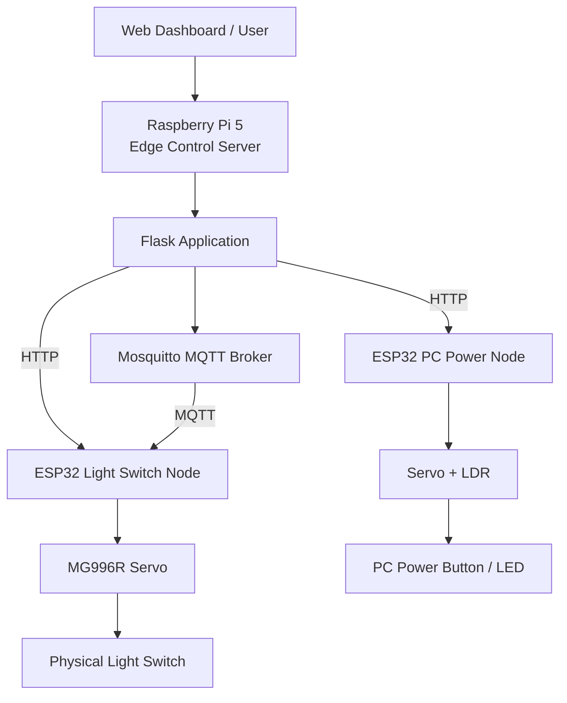

# Edge IoT Control System

**한국어** | [English](README_EN.md)

Raspberry Pi 5와 ESP32로 실제 물리 장치를 제어하고, 구현 과정에서 생긴 문제를 직접 측정하며 개선한 개인 프로젝트입니다. 전등 스위치와 PC 전원 버튼을 제어하는 기능을 만든 뒤, 통신 지연·ESP32 처리시간·메모리·Raspberry Pi 자원 사용량·실제 구동시간을 나누어 확인했습니다.

## Quick Links

**[전체 프로젝트 보고서 (PDF)](report/Edge_IoT_Control_System_Report.pdf)** · [실험 데이터 안내](data/README.md) · [Raw Data](data/raw/) · [분석 결과](data/processed/) · [ESP32 코드](esp32/) · [Raspberry Pi 코드](raspberry-pi/) · [English](README_EN.md)

## 핵심 하이라이트

- **Wi-Fi Sleep 영향:** MQTT QoS 0 평균 RTT가 Sleep ON **121.279 ms → OFF 15.886 ms**로 감소했습니다. 최종 1000회 본실험에서도 **15.319 ms**가 측정됐습니다.
- **통신 방식 비교:** 평균 Application RTT는 HTTP **20.515 ms**, MQTT QoS 0 **15.319 ms**, MQTT QoS 1 **61.282 ms**였습니다.
- **ESP32 내부 처리시간 분리:** Benchmark Handler 처리시간은 세 조건 모두 **약 0.4 ms**로 비슷했습니다. 따라서 수십 ms 수준의 RTT 차이는 Handler 계산시간만으로 설명되지 않았습니다.
- **실제 체감 지연:** Light Control 평균 완료시간은 **1032.247 ms**였고, 이 중 코드에 설정한 Servo Hold·Return 시간이 **1000 ms(약 96.9%)**였습니다.
- **물리 구동 개선:** 초기 MG90S에서는 **ON 20/20, OFF 7/20**이었습니다. 같은 고정 방식에서 MG996R로 교체한 뒤 당시 확인한 동작에서는 실패가 없었고, 이후 고정과 각도를 다듬은 최종 조건에서 **ON 20/20, OFF 20/20**을 확인했습니다.

---

## 시스템 구조



Raspberry Pi 5가 중앙 제어 서버 역할을 하고, ESP32가 실제 서보와 센서에 연결되는 제어 노드로 동작합니다.

## 구현한 기능

### 1. Light Switch Node

MG996R Servo를 이용해 벽면 스위치를 실제로 눌러 조명을 ON/OFF합니다.

```text
REST angle  : 90°
ON angle    : 50°
OFF angle   : 140°
Press Hold  : 400 ms
Return Wait : 600 ms
```

HTTP 제어, Local Button, HTTP/MQTT Benchmark, MQTT Application ACK, ESP32 Heap·RSSI 측정을 구현했습니다.

### 2. PC Power Node

PC가 이미 켜져 있는데 전원 버튼을 다시 누르는 상황을 줄이기 위해 **Ping + LDR**을 함께 사용했습니다.

```text
Ping 성공 OR LDR에서 LED ON 감지
→ PC ON

Ping 실패 AND LDR에서 LED OFF 감지
→ PC OFF 후보
```

PC가 OFF 후보일 때만 Servo가 실제 전원 버튼을 누르도록 구성했습니다.

---

## Protocol Benchmark

실제 서보 동작시간과 통신시간을 섞지 않기 위해 Benchmark Endpoint에서는 Servo, LDR, Ping과 의도적인 Servo Delay를 제외했습니다.

```text
Warm-up          : Protocol당 50회
Main Measurement : 200회 × 5 Runs
Samples/Protocol : 1000
Total Samples    : 3000
Wi-Fi Sleep      : OFF
```

Run마다 Protocol 실행 순서를 바꾸었고, 최종 3000개 요청은 모두 성공했습니다.

| Protocol | Mean RTT | Median | P95 | P99 |
|---|---:|---:|---:|---:|
| MQTT QoS 0 | **15.319 ms** | 13.988 ms | 22.980 ms | 31.076 ms |
| HTTP | **20.515 ms** | 19.450 ms | 28.807 ms | 37.038 ms |
| MQTT QoS 1 | **61.282 ms** | 59.508 ms | 79.849 ms | 94.444 ms |

이 값은 **Application RTT**입니다. 현재 HTTP 구현은 요청 후 연결을 종료하고, MQTT는 연결을 유지하므로 결과를 Protocol 자체의 일반적인 성능 순위로 해석하지 않습니다.


---

## 예상보다 높았던 MQTT Latency

MQTT QoS 0를 처음 측정했을 때 약 100 ms 수준의 RTT가 반복해서 나타났습니다. 다른 조건을 확인하는 과정에서 ESP32 Wi-Fi Sleep의 영향을 의심했고, ON/OFF 조건을 나누어 다시 측정했습니다.

| 조건 | 평균 RTT |
|---|---:|
| Wi-Fi Sleep ON | **121.279 ms** |
| Wi-Fi Sleep OFF | **15.886 ms** |
| Final QoS 0, Sleep OFF | **15.319 ms** |

`WiFi.setSleep(false)` 적용 후 RTT가 크게 줄었고, 최종 본실험에서도 비슷한 수준이 다시 나타났습니다. 이 경험을 통해 실험 결과가 예상과 다를 때 설정과 조건을 다시 확인하는 과정의 중요성을 배웠습니다.

---

## ESP32 내부 처리시간

ESP32 Benchmark Handler 내부에 `micros()` 기반 타이머를 넣어 처리시간을 따로 측정했습니다.

| Protocol | Mean ESP32 Processing |
|---|---:|
| HTTP | **401.999 µs** |
| MQTT QoS 0 | **419.632 µs** |
| MQTT QoS 1 | **420.765 µs** |

세 조건 모두 약 0.4 ms로 비슷했습니다. 전체 RTT가 약 15~61 ms였던 것과 비교하면, Protocol별 차이는 적어도 이 Handler 내부 계산시간만으로 설명되지 않았습니다.


---

## 실제 Light Control 지연

Protocol Benchmark와 별도로 실제 Light ON/OFF 요청의 완료시간도 측정했습니다.

| 항목 | 값 |
|---|---:|
| Mean E2E | **1032.247 ms** |
| Programmed Servo Delay | **1000 ms** |
| Servo Delay 비중 | **약 96.9%** |

Servo 코드에는 `Press Hold 400 ms + Return Wait 600 ms`가 들어 있습니다. 따라서 실제 사용자가 느끼는 약 1초의 대부분은 통신이 아니라 Servo를 안정적으로 움직이기 위해 넣은 시간에서 발생했습니다.


---

## 물리 구동 문제와 개선

초기 MG90S 조건의 실제 스위치 시험 결과는 다음과 같았습니다.

```text
ON  : 20 / 20
OFF : 7 / 20
```

처음에는 Servo 힘을 의심했고, **고정 방식은 그대로 둔 채 MG996R로 교체**했습니다. 그 상태에서 당시 확인한 동작에서는 실패가 없었습니다.

이후에는 힘 자체보다 스위치를 너무 깊게 누르거나, 반대로 각도가 부족해 충분히 눌리지 않는 문제가 보였습니다. 그래서 고정을 더 안정적으로 만들고 누름 각도를 조정했습니다.

```text
Final
ON  : 20 / 20
OFF : 20 / 20
```

최종 40회는 단기 검증 결과이며, 장기 사용 신뢰성을 확인한 시험은 아닙니다.

---

## 추가로 확인한 내용

- **ESP32 Heap:** 3000개 Sample을 실제 측정 시간순으로 다시 정렬해 확인한 결과, 실험 전체에서 Free Heap이 지속적으로 감소하는 형태는 관찰되지 않았습니다.
- **Raspberry Pi 자원:** 약 0.2초 간격의 순차 요청 조건에서 Python Worker 평균 CPU는 약 **0.4%**, RSS는 약 **23 MiB** 수준이었습니다.

자세한 Raw Data와 그래프는 [data/README.md](data/README.md)에 정리했습니다.

---

## Repository 구조

```text
.
├── analysis/        # 분석 및 그래프 생성 Script
├── data/            # Raw / Processed Data, Figures
├── esp32/           # ESP32 Firmware
├── raspberry-pi/    # Flask Server / Benchmark
├── docs/            # 개발 과정 및 초기 계획
├── images/
├── report/
│   └── Edge_IoT_Control_System_Report.pdf
├── README.md
└── README_EN.md
```

## 분석 재현

```bash
python -m pip install -r analysis/requirements.txt
python -m pip install -r raspberry-pi/server/requirements.txt

python analysis/analyze_protocol_benchmark.py
python analysis/plot_protocol_benchmark.py
python analysis/plot_bottleneck_heap.py
python analysis/plot_pi_resources.py
python analysis/plot_light_e2e.py
```

Raw CSV를 분석의 Source of Truth로 사용하며, 최종 분석에서 제외한 데이터도 이유와 함께 `excluded/` 또는 `legacy/`에 보존했습니다.

---

## 이 프로젝트의 범위

- 측정은 하나의 Local Wi-Fi 환경에서 수행했습니다.
- HTTP와 MQTT의 연결 방식이 다르므로 Benchmark 결과는 현재 구현 조건에서의 Application RTT 비교입니다.
- Light E2E는 외부 Sensor로 실제 접촉 순간을 잰 값이 아니라 Application Request Completion 기준입니다.
- 물리 구동 40/40은 최종 구성에서 수행한 단기 반복 시험입니다.

---

## 이후 관심 방향

이 프로젝트를 진행하면서 기능을 추가하는 것보다 실제 시스템에서 시간이 어디에 쓰이고, 설정에 따라 성능이 왜 달라지는지를 확인하는 과정에 더 흥미를 느꼈습니다.

앞으로 운영체제, 메모리 시스템, 컴퓨터구조를 더 공부하면서 시스템 성능을 더 깊게 측정하고 분석하는 경험을 쌓고 싶습니다.
