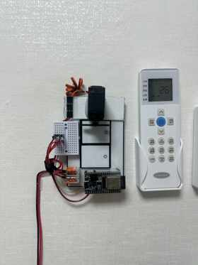
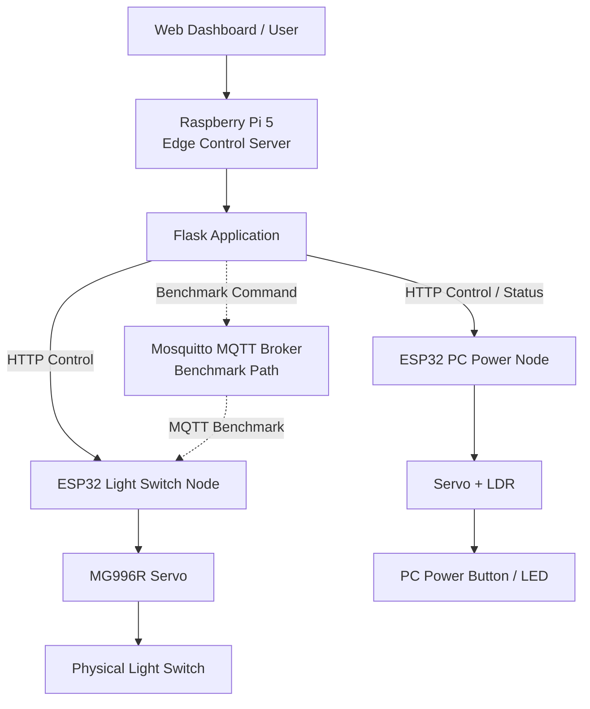

# Edge IoT Control System

[한국어](README.md) | **English**

A personal Raspberry Pi 5–ESP32 project that started with physical device control and expanded into measuring and improving system behavior. After implementing wall-light and PC power control, I separately examined communication latency, ESP32 processing time, memory behavior, Raspberry Pi resource usage, and actual actuation time.

## Quick Links

**[Full Project Report (PDF)](report/Edge_IoT_Control_System_Report.pdf)** · [Dataset Guide](data/README_EN.md) · [Raw Data](data/raw/) · [Processed Results](data/processed/) · [ESP32 Code](esp32/) · [Raspberry Pi Code](raspberry-pi/) · [한국어](README.md)

## Actual Implementation

<p align="center">
  
  
</p>

<p align="center">
  <b>Light Switch Node</b> · <b>PC Power Node</b>
</p>

## Highlights

- **Wi-Fi configuration had a major latency impact:** While investigating unexpectedly high MQTT QoS 0 RTT, I isolated Wi-Fi Sleep as a variable; disabling it reduced mean RTT from **121.279 ms to 15.886 ms**.
- **Compared protocol behavior under the same test conditions:** HTTP, MQTT QoS 0, and MQTT QoS 1 were each measured across 1000 requests, including application RTT and tail latency.
- **Separated ESP32 processing from end-to-end RTT:** Benchmark-handler processing stayed near **0.4 ms** for all three conditions, showing that the protocol-level RTT differences were not explained by ESP32 handler computation alone.
- **Separated the user-visible control bottleneck:** About **96.9%** of the roughly 1.03 s Light Control time came from intentionally programmed servo hold/return timing rather than communication.
- **Improved physical reliability:** I separated switch-actuation failures from network behavior, tuned servo capability, mounting, and angles, and confirmed **40/40 ON/OFF** in the final short-run validation.

---

## System Architecture



The Raspberry Pi 5 acts as the central control server, while the ESP32 boards operate as control nodes connected to the physical servos and sensors. **Actual Light/PC control uses the HTTP path; the MQTT path is an experimental path added for protocol benchmarking.**

## Implemented Nodes

### 1. Light Switch Node

An MG996R servo physically presses a wall switch to turn the light ON/OFF.

```text
REST angle  : 90°
ON angle    : 50°
OFF angle   : 140°
Press Hold  : 400 ms
Return Wait : 600 ms
```

Implemented functions include HTTP control, local buttons, HTTP/MQTT benchmarks, MQTT application ACK, and ESP32 heap/RSSI measurements.

### 2. PC Power Node

To reduce unnecessary power-button presses when the PC is already on, the node combines **Ping + LDR** state checks.

```text
Ping succeeds OR LDR detects LED ON
→ PC ON

Ping fails AND LDR detects LED OFF
→ PC OFF candidate
```

The servo presses the physical power button only when the PC is classified as an OFF candidate.

---

## Protocol Benchmark

To separate communication time from physical actuation, the benchmark endpoint excludes servo movement, LDR sampling, Ping, and programmed servo delays.

```text
Warm-up          : 50 requests per protocol
Main Measurement : 200 requests × 5 runs
Samples/Protocol : 1000
Total Samples    : 3000
Wi-Fi Sleep      : OFF
```

Protocol order was rotated across runs, and all 3000 final requests succeeded.

| Protocol | Mean RTT | Median | P95 | P99 |
|---|---:|---:|---:|---:|
| MQTT QoS 0 | **15.319 ms** | 13.988 ms | 22.980 ms | 31.076 ms |
| HTTP | **20.515 ms** | 19.450 ms | 28.807 ms | 37.038 ms |
| MQTT QoS 1 | **61.282 ms** | 59.508 ms | 79.849 ms | 94.444 ms |

These values are **application RTT**. The current HTTP implementation closes the connection after each request, while MQTT keeps a connection open, so this should not be read as a universal protocol ranking.


---

## Unexpected MQTT Latency

Early MQTT QoS 0 measurements repeatedly showed RTT near the 100 ms scale. While checking other conditions, I tested whether ESP32 Wi-Fi Sleep was affecting latency.

| Condition | Mean RTT |
|---|---:|
| Wi-Fi Sleep ON | **121.279 ms** |
| Wi-Fi Sleep OFF | **15.886 ms** |
| Final QoS 0, Sleep OFF | **15.319 ms** |

After applying `WiFi.setSleep(false)`, RTT dropped substantially, and the final benchmark reproduced a similar value. This became one of the clearest examples in the project of re-checking experimental conditions when a result looked unexpected.

---

## ESP32 Processing Time

Processing time inside the ESP32 benchmark handler was measured separately using `micros()`.

| Protocol | Mean ESP32 Processing |
|---|---:|
| HTTP | **401.999 µs** |
| MQTT QoS 0 | **419.632 µs** |
| MQTT QoS 1 | **420.765 µs** |

All three conditions were close to 0.4 ms. Compared with the 15–61 ms application RTT values, the protocol-dependent differences were not explained by the measured handler computation alone.


---

## Actual Light Control Latency

Actual Light ON/OFF completion time was measured separately from the protocol benchmark.

| Item | Value |
|---|---:|
| Mean E2E | **1032.247 ms** |
| Programmed Servo Delay | **1000 ms** |
| Share of Servo Delay | **about 96.9%** |

The servo sequence contains `Press Hold 400 ms + Return Wait 600 ms`. Most of the roughly one-second user-visible delay therefore came from intentionally programmed actuator timing rather than communication.


---

## Physical Actuation Issue and Improvement

The initial MG90S wall-switch tests produced:

```text
ON  : 20 / 20
OFF : 7 / 20
```

I first suspected servo capability and replaced **only the MG90S with an MG996R while keeping the same mounting method**. No failures were observed in the checks performed at that stage.

Afterward, the remaining issue was tuning the mechanical interaction: some angles pressed too deeply, while smaller angles did not press far enough. I therefore reinforced the mounting and adjusted the actuation angles.

```text
Final
ON  : 20 / 20
OFF : 20 / 20
```

The final 40 trials are a short-run validation, not a long-term durability test.

---

## Additional Observations

- **ESP32 Heap:** After reconstructing all 3000 samples in chronological order, no persistent downward Free Heap trend was observed across the benchmark.
- **Raspberry Pi resources:** Under the sequential workload with roughly 0.2 s request intervals, Python Worker CPU averaged about **0.4%** and RSS about **23 MiB**.

More detailed raw data and figures are documented in [data/README_EN.md](data/README_EN.md).

---

## Repository Structure

```text
.
├── analysis/        # Analysis and plotting scripts
├── data/            # Raw / Processed Data, Figures
├── esp32/           # ESP32 firmware
├── raspberry-pi/    # Flask server / benchmark tools
├── docs/            # Development notes and initial plans
├── images/
├── report/
│   └── Edge_IoT_Control_System_Report.pdf
├── README.md
└── README_EN.md
```

## Reproducing the Analysis

```bash
python -m pip install -r analysis/requirements.txt
python -m pip install -r raspberry-pi/server/requirements.txt

python analysis/analyze_protocol_benchmark.py
python analysis/plot_protocol_benchmark.py
python analysis/plot_bottleneck_heap.py
python analysis/plot_pi_resources.py
python analysis/plot_light_e2e.py
```

Raw CSV files are treated as the source of truth. Measurements excluded from the final analysis are preserved with their reasons under `excluded/` or `legacy/` rather than silently deleted.

---

## Scope

- Measurements were performed in one local Wi-Fi environment.
- HTTP and MQTT use different connection models, so the benchmark compares application RTT under the current implementations.
- Light E2E measures application request completion, not the exact instant of physical switch contact.
- The 40/40 physical actuation result is a short-run validation of the final configuration.

---

## Future Interests

Through this project, I became more interested in where time is spent inside a real system and why performance changes under different settings than in simply adding more features.

I would like to study operating systems, memory systems, and computer architecture in greater depth and continue building experience in system performance measurement and analysis.
